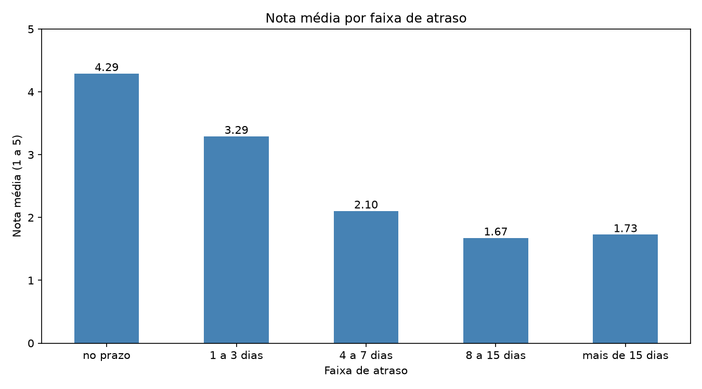
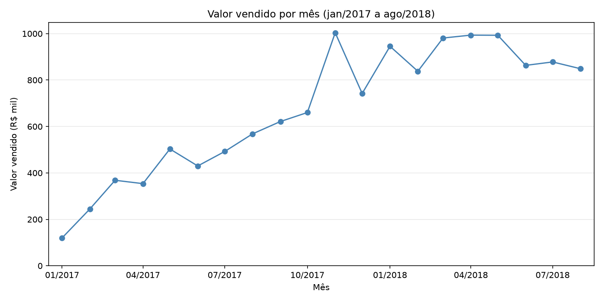
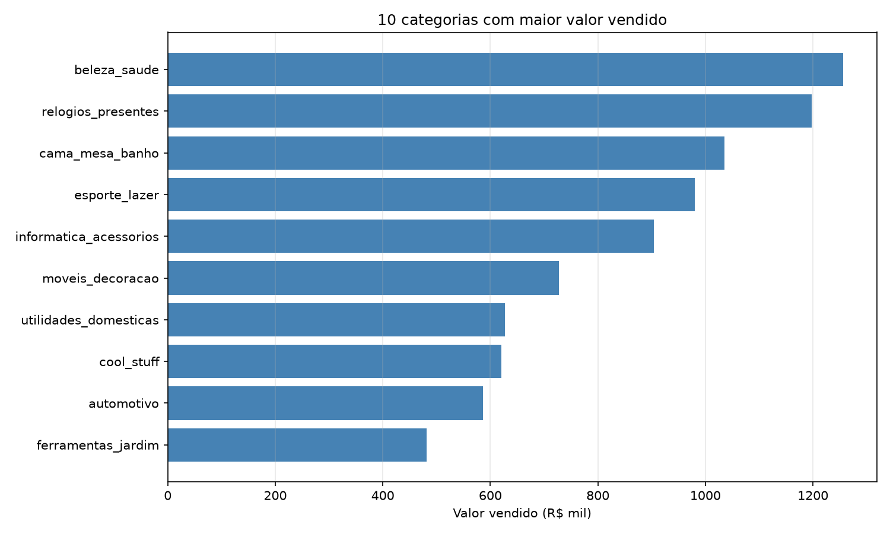
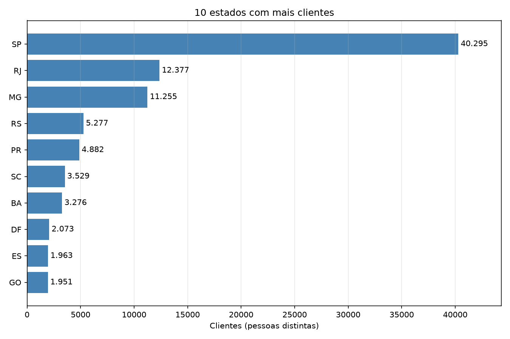

# Análise de vendas e entregas da Olist

Análise exploratória dos dados públicos da Olist, um marketplace brasileiro, feita em Python com pandas e matplotlib. Usei pedidos reais de setembro de 2016 a outubro de 2018 para responder quatro perguntas de negócio.

O código está em [`notebooks/01_exploracao.ipynb`](notebooks/01_exploracao.ipynb).

## Perguntas

1. O atraso na entrega derruba a nota de avaliação?
2. Como o valor vendido evoluiu mês a mês?
3. Quais categorias de produto mais vendem?
4. Quais estados concentram os clientes?

## Dados

[Brazilian E-Commerce Public Dataset by Olist](https://www.kaggle.com/datasets/olistbr/brazilian-ecommerce), disponível no Kaggle. Usei as tabelas de pedidos, itens, avaliações, produtos e clientes, e a de tradução de categorias para conferência. Não usei as de pagamentos, vendedores e geolocalização. Os arquivos não estão no repositório por causa do tamanho.

## Resultados

### Atraso e nota de avaliação

Dos 95.824 pedidos entregues com avaliação, 6.381 (cerca de 6,7%) chegaram depois do prazo estimado. A nota média desses pedidos foi 2,27, contra 4,29 dos que chegaram no prazo. A maior queda acontece na primeira semana de atraso: a nota vai de 4,29 para 3,29 com 1 a 3 dias e para 2,10 com 4 a 7 dias, e depois se estabiliza perto de 1,7. Isso mostra que atraso e nota baixa andam juntos, mas não prova que o atraso é a única causa.

### Valor vendido por mês

Somei o preço dos itens vendidos, sem frete e sem pedidos cancelados ou indisponíveis. O valor vendido cresceu ao longo de 2017, de R$ 120 mil em janeiro para R$ 1,00 milhão em novembro, e ficou entre R$ 838 mil e R$ 994 mil de janeiro a agosto de 2018. O dia 24 de novembro de 2017, a Black Friday daquele ano (segundo o g1), vendeu R$ 152,7 mil, cerca de 4,6 vezes a média diária do mês. O pico coincide com a data, mas os dados não mostram que ela foi a causa.

### Categorias que mais vendem

Em valor vendido, lideram beleza_saude (R$ 1,26 milhão), relogios_presentes (R$ 1,20 milhão) e cama_mesa_banho (R$ 1,04 milhão). O ranking por quantidade de itens é diferente: cama_mesa_banho vendeu mais itens (11.097), e relogios_presentes ficou em segundo em valor com só 5.970 itens, por ter o preço médio mais alto (cerca de R$ 201 por item).

### Estados com mais clientes

São Paulo concentra 40.295 clientes, cerca de 41,9% do total. Com Rio de Janeiro (12,9%) e Minas Gerais (11,7%), os três somam por volta de 66%. Parte dessa concentração pode vir apenas do tamanho da população, mas os dados da Olist não permitem separar isso.

## Decisões e limitações

- Cada pedido tem um `customer_id` próprio, então contei clientes pelo `customer_unique_id`.
- 547 pedidos têm mais de uma avaliação (em 202 deles as notas são diferentes). Fiquei com a mais recente, considerando que ela representa a decisão final do cliente.
- 8 pedidos estão como entregues, mas sem data de entrega. Deixei esses de fora da análise de atraso.
- No gráfico de valor vendido por mês, usei somente janeiro de 2017 a agosto de 2018. Os meses de 2016 somam 293 pedidos e setembro de 2018 tem apenas 1, já sem os cancelados e indisponíveis.
- 1.589 itens (cerca de 1,4%) são de produtos sem categoria. Mantive esses itens com o rótulo `sem_categoria`.
- Chamei de "valor vendido" e não de faturamento porque a Olist é um marketplace: o que somei é o que os lojistas venderam, e não a receita da empresa.
- A análise mostra relações entre os dados, mas não identifica causas.

## Como rodar

1. Baixe o dataset no Kaggle e coloque os arquivos CSV na pasta `data/`;
2. crie um ambiente virtual e instale pandas, matplotlib e Jupyter;
3. abra `notebooks/01_exploracao.ipynb` e execute as células em ordem.